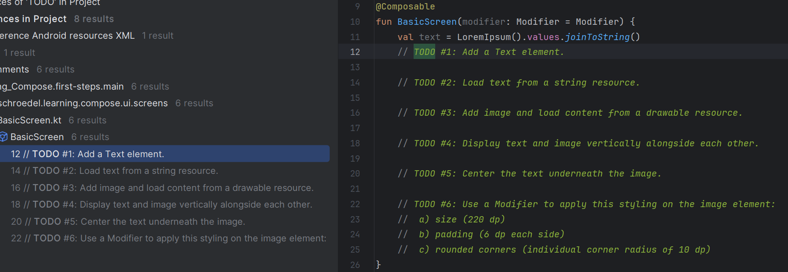

# Learning Compose

This repository is a collection of small tutorials, samples and a collection of links - all intended for learning Jetpack Compose by self-study.

Each individual module will teach you a thing or two about Compose.
Your tasks for self-study are marked as `TODO #n` within the source code.

**It is up to you to fill the blanks!**

You can always refer to the `solutions` branch whenever you feel stuck or want to compare your implementation.
**Just please don't cheat yourself!!!**

In case you feel like you are lacking important knowledge, refer to the [knowledge base section](#knowledge-base) to catch up on a certain topic.

## Basics for Beginners

Basic knowledge for Jetpack Compose beginners is thought in a small step by step example: [first-steps module](./first-steps)

**You will learn:**

* How to display text in Compose
* Displaying images
* Basic layouting rules and elements
* How to style individual UI elements

**Follow along by watching this video (German + English Subtitles):**

## Knowledge Base

A collection of supporting learning material for self-study.
This section will grow over time.

### Basic Knowledge

* [Tutorial by Google (doc)](https://developer.android.com/develop/ui/compose/tutorial)
* [Quickstart including Android Studio project (doc)](https://developer.android.com/develop/ui/compose/setup)
* [Understanding the mental model of Compose (doc)](https://developer.android.com/develop/ui/compose/mental-model)

### Basic Elements and Layouts

* [Text in Compose (codelab)](https://developer.android.com/codelabs/basic-android-kotlin-compose-text-composables#0)
* [Images in Compose (codelab)](https://developer.android.com/codelabs/basic-android-kotlin-compose-add-images#0)
* [Simple layout practices (codelab)](https://developer.android.com/codelabs/basic-android-kotlin-compose-composables-practice-problems?hl=en#0)
* [Layouts and Modifiers (video)](https://www.youtube.com/watch?v=xc8nAcVvpxY)

### Material Elements and Layouts

* [Basic layouts (codelab)](https://developer.android.com/codelabs/jetpack-compose-layouts?hl=en#0)
* [Material components (doc)](https://developer.android.com/develop/ui/compose/components)

### State Handling

* [Compose state (codelab)](https://developer.android.com/codelabs/jetpack-compose-state?hl=en#0)
* [Compose state (doc)](https://developer.android.com/develop/ui/compose/state)
* [Compose architecture patterns (doc)](https://developer.android.com/develop/ui/compose/architecture#udf)

## FAQ

### You want to learn about a certain Compose topic that is not covered here yet

Great!
Open an issue and label it as **enhancement**, then let's talk about what you are looking for.

### You found a bug

Feel free to create an issue and label it as **bug**.

### You have an idea for additional documentation or learning material

Fantastic!
Open an issue and label your proposal as **documentation**.

### You have a question related to a learning section

Please add a comment underneath the related **YouTube video**, so others can read your question as well.
In case there is no video (yet) create an issue and label it as **question**.
